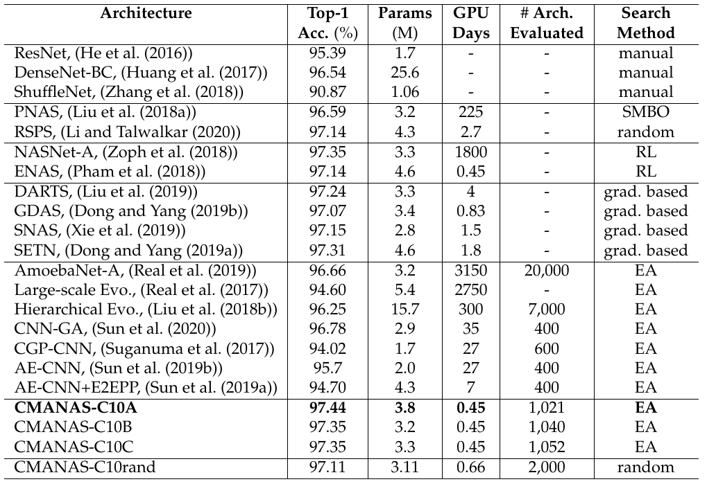
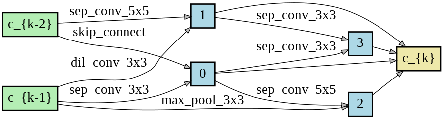

# Neural Architecture Search using Covariance Matrix Adaptation Evolution Strategy 

**This code is based on the implementation of [DARTS](https://github.com/quark0/darts) and [AutoDL-Projects](https://github.com/D-X-Y/AutoDL-Projects).**
**The training code for the ImageNet dataset is taken from [P-DARTS](https://github.com/chenxin061/pdarts)**

## Requirements
```
Python >= 3.6.9, PyTorch >= 1.5.0, torchvision == 0.6.0
```

## Introduction
This repository contains the code for our work called Neural Architecture Search using Covariance Matrix Adaptation Evolution Strategy (CMANAS).
In this method, we propose a framework of applying Covariance Matrix Adaptation Evolution Strategy (CMA-ES) to the neural architecture search
problem, which achieves better results than previous evolution based methods while reducing the search time significantly.
The architectures are modelled by a normal distribution which is updated using CMAES based on the fitness of the sampled population. We use the
accuracy of a trained one shot model (OSM) on validation data as a prediction of the fitness of individual architecture to reduce
the search time. We also use an architecture-fitness table (AF table) for keeping record of the already evaluated architecture thus
further reducing the search time. The whole algorithm is summarized below.


## Search Space S1
This search space is similar to the one used in [DARTS](https://github.com/quark0/darts). To download the discovered cells
reported in the paper, please use this [link](https://drive.google.com/drive/folders/1jDDl4VEdTpK2fWrJowKxZ4ZjSE04d27r?usp=sharing).
### Architecture search 
#### On CIFAR-10 dataset
```
bash ./s1/arch_search.sh cifar10 0 1 model
```
#### On CIFAR-100 dataset
```
bash ./s1/arch_search.sh cifar100 0 1 model
```
#### Results
<!---  --->
<table>
  <tr>
     <th>Search Results on CIFAR-10</th>
  </tr>
  <tr>
    <td></td>
  </tr>
  <tr>
     <th>Search Results on CIFAR-100</th>
  </tr>
  <tr>
    <td></td>
  </tr>

</table>

#### Testing the discovered cells
```
bash ./s1/test_arch.sh cifar10 0 ../../../data 1024 discovered_cells/genotype_CMANAS_C10C.pickle discovered_cells/weights_CMANAS_C10C.pt .
```
Replace cifar10 with cifar100 for testing the discovered cells on CIFAR-100.

#### Best Discovered Cells on CIFAR-10 and CIFAR-100
<table>
  <tr>
     <th>Normal Cell of CMANAS-C10A</th>
     <th>Reduction Cell of CMANAS-C10A</th>
  </tr>
  <tr>
    <td></td>
    <td></td>
  </tr>
</table>

<table>
  <tr>
     <th>Normal Cell of CMANAS-C100A</th>
     <th>Reduction Cell of CMANAS-C100A</th>
  </tr>
  <tr>
    <td></td>
    <td></td>
  </tr>
</table>

#### ImageNet Result


#### Testing the discovered cells on ImageNet dataset
```
bash ./s1/test_arch.sh imagenet 0 ../../../data/imagenet 1024 discovered_cells/genotype_CMANAS_C10A.pickle discovered_cells/imagenet_CMANAS_C10A.pth.tar .
```

## Search Space S2
This search space is similar to the one used in [NAS-BENCH-201](https://github.com/D-X-Y/NAS-Bench-201).
### Dataset
To download ImageNet-16-120 use the [link](https://drive.google.com/drive/folders/1T3UIyZXUhMmIuJLOBMIYKAsJknAtrrO4). To use the NAS-201
benchmark for evaluating the search method, download the file [NAS-Bench-201-v1_1-096897.pth](https://drive.google.com/file/d/16Y0UwGisiouVRxW-W5hEtbxmcHw_0hF_/view)

### Architecture search by Weight Sharing based CMANAS
Using CIFAR-10, CIFAR-100, ImageNet16-120:
```
 bash ./s2/weight_sharing/arch_search.sh cifar10 0 1 model 
 bash ./s2/weight_sharing/arch_search.sh cifar100 0 1 model 
 bash ./s2/weight_sharing/arch_search.sh ImageNet16-120 0 1 model 
```

### Architecture search by Non-Weight Sharing based CMANAS
Using CIFAR-10, CIFAR-100, ImageNet16-120:
```
 bash ./s2/non_weight_sharing/arch_search.sh cifar10 outputs/s2 25 500
 bash ./s2/non_weight_sharing/arch_search.sh cifar100 outputs/s2 25 500
 bash ./s2/non_weight_sharing/arch_search.sh ImageNet16-120 outputs/s2 25 500
```
#### Results


#### Visualizing the Mean of the Normal Distribution
Architecture Search using weight sharing based CMANAS on
<table>
  <tr>
     <th>CIFAR-10</th>
     <th>CIFAR-100</th>
  </tr>
  <tr>
    <td></td>
    <td></td>
  </tr>
  <tr>
     <th colspan="2">ImageNet16-120</th>
  </tr>
  <tr>
    <td colspan="2" align="center"></td>
  </tr>

</table>

Architecture Search using non-weight sharing based CMANAS on
<table>
  <tr>
     <th>CIFAR-10</th>
     <th>CIFAR-100</th>
  </tr>
  <tr>
    <td></td>
    <td></td>
  </tr>
  <tr>
     <th colspan="2">ImageNet16-120</th>
  </tr>
  <tr>
    <td colspan="2" align="center"></td>
  </tr>

</table>
